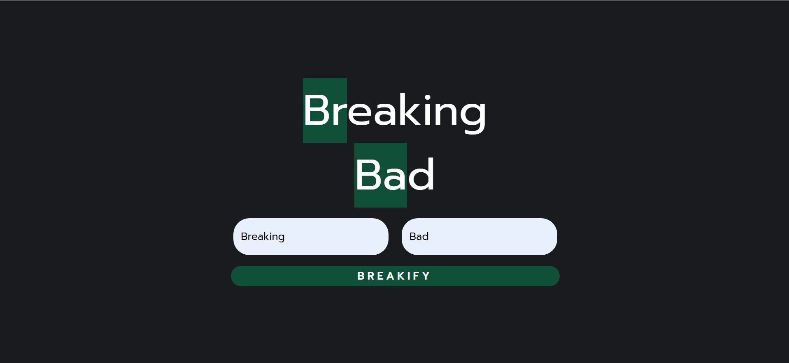

# Element Symbol Highlighter

This is a simple JavaScript application that highlights element symbols in a given string using the Periodic Table elements list. It is inspired by the title of the TV series "Breaking Bad," where the element symbols "Br" and "Ba" get highlighted.

## How It Works

The application takes an input string and searches for matches with element symbols from the Periodic Table. If a match is found, it wraps the matched parts in `` tags with a background color, resulting in a highlighted effect.

## Usage

1. Clone the repository to your local machine:

2. Open `index.html` in your web browser.

3. Enter your desired input string in the input field, and click the "Highlight" button.

4. The highlighted version of the input string will be displayed below.

## Contributing

Contributions are welcome! If you have any ideas, bug fixes, or improvements, feel free to open an issue or submit a pull request.

## Author: ChayanNath
